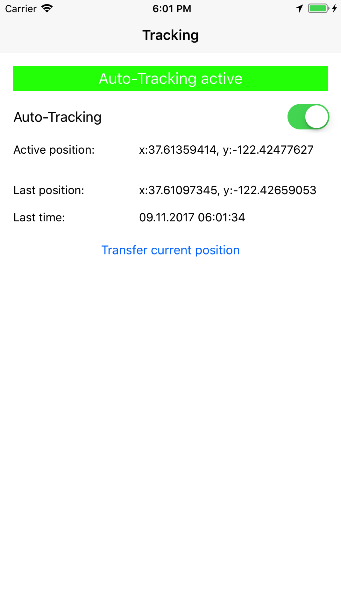

RxLocation
======

RxLocation is a one-page application used RxSwift. The main functionality is focused on CoreLocation service. 
App is capture locations data, filter it by specific requirements and shows to the user. It is assumed that this data
should be send to the server.

Features
--------

* Using [RxSwift](https://github.com/ReactiveX/RxSwift)
* Using [ReactorKit](https://github.com/devxoul/ReactorKit)
* Dependency Injection with [Swinject](https://github.com/Swinject/Swinject) and [SwinjectAutoregistration](https://github.com/Swinject/SwinjectAutoregistration)
* Testing with RxTest

Business Requirements
------------

Transferring of the position data should be periodic and dependent on the movement and the following rules:
* The transmission is to be performed at least once per minute (at standstill) and at position change of more than 10 m.
* Transmission should not take place faster than every 10 seconds.
* Button "Transfer current position" should immediately request and send current coordinates of device. 

Most of this requirements are described in the 
and implemented in  

Screenshots
-----------

License
-------

RxLocation is under [MIT License](LICENSE).
